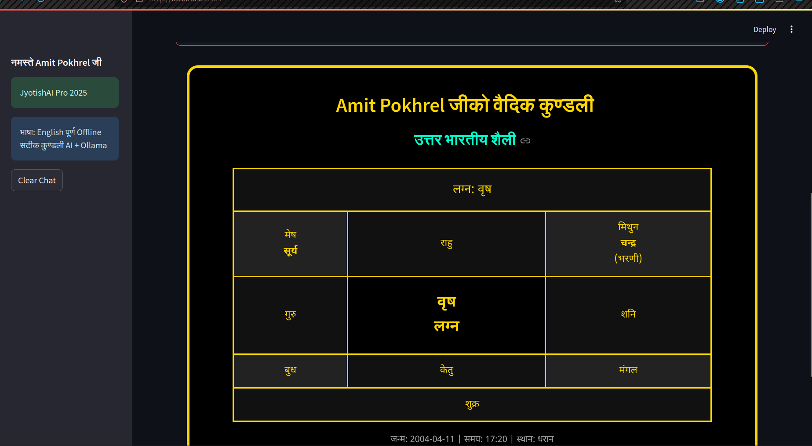
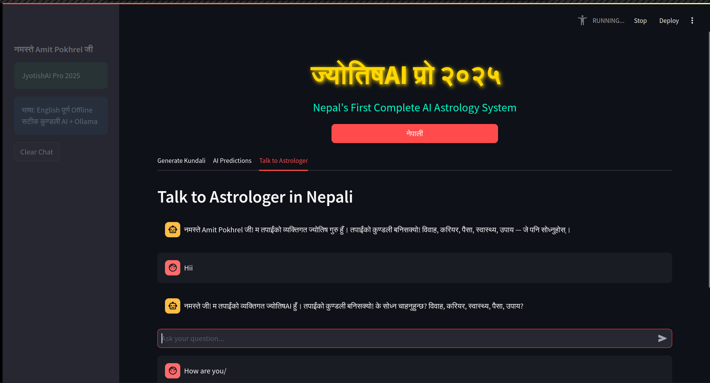
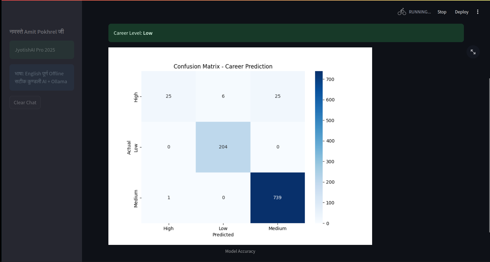

<div align="center">

# ज्योतिषAI प्रो २०२५  
**नेपालको पहिलो पूर्ण Offline AI ज्योतिष प्रणाली**  
**JyotishAI Pro 2025 – Nepal's First Complete AI-Powered Vedic Astrology System**

   

</div>

## परियोजना विशेषता (Project Features)

| सुविधा | विवरण |
|--------|-------|
| Real कुण्डली | PyEphem बाट सूर्य, चन्द्र, लग्न, नक्षत्र गणना |
| AI भविष्यवाणी | Random Forest ML Model (करियर, स्वास्थ्य, विवाह) |
| Ollama च्याटबोट | Llama3.2:1b बाट नेपालीमा ज्योतिष सल्लाह |
| RAG सिस्टम | 100+ पृष्ठ वैदिक ज्योतिष PDF बाट सटीक जवाफ |
| सुन्दर कुण्डली चार्ट | उत्तर भारतीय शैलीको HTML चार्ट |
| नेपाली + English | पूर्ण भाषा स्विचर |
| पूर्ण Offline | इन्टरनेट बिना चल्छ |
| PDF डाउनलोड | कुण्डली PDF डाउनलोड गर्न सकिन्छ |

## डेमो स्क्रिनसटहरू




## आवश्यकता (Requirements)

```txt
streamlit
ollama
pyephem
scikit-learn
pandas
numpy
chromadb
pypdf2
joblib
